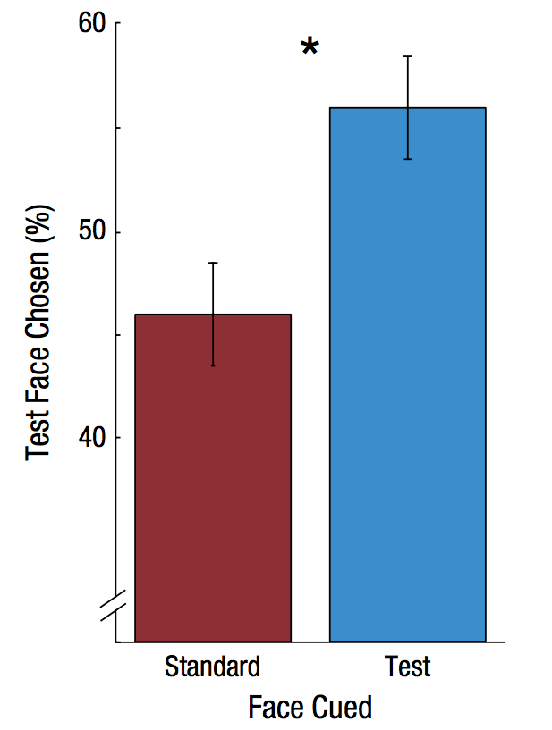

<!-- Replication reports should all use this template to standardize reporting across projects.  These reports will be public supplementary materials that accompany the summary report(s) of the aggregate results. -->

##Introduction

[No abstract is needed.]  Each replication project will have a straightforward, no frills report of the study and results.  These reports will be publicly available as supplementary material for the aggregate report(s) of the project as a whole.  Also, to maximize project integrity, the intro and methods will be written and critiqued in advance of data collection.  Introductions can be just 1-2 paragraphs clarifying the main idea of the original study, the target finding for replication, and any other essential information.  It will NOT have a literature review -- that is in the original publication. You can write both the introduction and the methods in past tense.  

In their study, Störmer & Alvarez (2016, Psychological Science) tested whether attention can alter the appearance of real-world stimuli. They asked three questions: 1) Does attention alter perceived attractiveness of faces? 2) Is the change in attractiveness judgments driven by exogenous (involuntary) attention? 3) Does the attentional cue influence attractive judgments by modulating the apparent local contrast of the faces? There results showed that attention altered the perception of facial attractiveness which belongs to higher-level aspects of perception. In the current replication project, we aim to replicate Experiment 3 of their study in which they found that attention increased the apparent contrast around the eye region of the faces which has been reported to be correlated with attractiveness.

##Methods

###Power Analysis
The effect size reported in the original paper was η^2=0.30 (t(15) = 2.51, p = .02). Post hoc power analysis using G*Power indicated that the power of the original study was 0.65. We would need 22 participants to achieve 80% power, 29 participants to achieve 90% power, and 35 participants to achieve 95% power to be able to detect the reported effect size. We aim to acieve 80% power. However, to shorten the duration of the experiment for each participant, we are going to split the experiment into halves and double the number of participants. That will give us a sample size of 44.

Original effect size, power analysis for samples to achieve 80%, 90%, 95% power to detect that effect size.  Considerations of feasibility for selecting planned sample size.

###Planned Sample

Planned sample size and/or termination rule, sampling frame, known demographics if any, preselection rules if any.

###Materials
"A small black fixation cross (0.5°×0.5°) was presented in the center of the screen throughout the experiment. Two small horizontal lines (~0.5° long) were presented to the left and right of fixation and served as landmarks for the horizontal midline of the screen. The target display consisted of two faces (each 8°×6°) that were presented to the left and right of fixation at an eccentricity of 6°. The face images were chosen from 20 images of female Caucasian faces taken from Bronstad and Russell’s (2007) database. They were converted to gray scale and cropped such that only their inner features were visible. All the faces were matched in overall brightness (104 cd/m2), but the contrast of the eye region was systematically manipulated for each face. Specifically, a mask covering the eyes and the eyebrows was created for each face, and the contrast within that mask was manipulated by parametrically changing the standard deviation of that section of the image using MATLAB. For each face, five different contrast levels were created. These levels were measured in terms of root-mean-square error (RMSE) of the pixels’ luminance values within the masked region. Contrast levels of 0.30, 0.35, 0.39, 0.44, and 0.50 RMSE were used. On every trial, the contrast around the eyes of one face, the standard face, was fixed at Level 3, and the contrast around the eyes of the other face, the test face, was randomly chosen from the five contrast levels. The left-right positions of the standard and test faces were randomized across trials. In each target display, one of the faces was shifted slightly upward from the horizontal midline, and the other face was shifted slightly downward from the midline (shift of ~0.5° each direction). A small black circle (diameter of 0.6°) presented on the left or right served as the visual cue; it was placed approximately at the location in between the eyes of the subsequent face image."

###Procedure
"The experiment was conducted in a dimly lit room, and the stimuli were presented on a 15-in. CRT display (1,280 × 1,024 pixels; 85 Hz) whose background color was set to gray (111 cd/m2). Participants viewed the stimuli at a distance of 57 cm, and a chin rest was used to stabilize their heads. Participants’ gaze was tracked with an eye tracker (EyeLink 1000, SR Research Ltd.) to ensure fixation. The experiment was run in MATLAB using the Psychophysics Toolbox (Brainard, 1997; Pelli, 1997). Participants were instructed to maintain their gaze on the fixation cross in the center of the gray screen throughout each experimental block. When they moved their gaze more than 1.5° away from fixation, the trial was aborted. At the beginning of each trial, a black circle appeared briefly (~70 ms) on either the left or the right side of the screen. After another 58 ms, face images were presented simultaneously on the left and right for 58 ms (Fig. 1a). Thus, the stimulus onset asynchrony (SOA) between the attentional cue and the faces was 128 ms. After the offset of the faces, the gray screen with the fixation cross was presented until the participant responded. The  intertrial interval varied from 1.0 to 1.5 s. On two thirds of the trials, two different faces were randomly selected from the set of 20 faces to be presented as the target display. One of the faces was presented at the standard contrast (Level 3), and the other face was presented at one of the test contrasts (Levels 1–5). On the other third of the trials, the exact same face was presented on the left and right at the standard contrast. These trials were included so that we could compare responses to cued and uncued faces while all physical attributes of the two faces were matched. The analyses of the effects of the attentional cue on attractiveness judgments focused on these matched-face trials."

"Experiment 3 followed the same procedure as Experiment 1 except for the task instructions. Participants were asked to report the vertical positioning (upward or downward) of the face that appeared to have higher contrast around the eye region by pressing the up- or down-arrow key on a keyboard. Prior to the experiment, participants were shown three example stimuli and were told that contrast varied around the eye region. As in the other experiments, participants were told that the black dot (the attentional cue) was task irrelevant."

###Analysis Plan
>There was a main effect of actual contrast level on contrast judgments,
>F(4, 15) = 27.93, p = .0001, η2 = .31. Participants chose the face with 
>higher contrast around the eye region more often than the face with
>lower contrast around the eye region. As in the previous experiments, 
>our main analysis focused on the matched-face trials, in which identical 
>faces were presented at Contrast Level 3. As shown in Figure 4b, 
>when the two faces were physically identical, participants tended to
>judge the face at the cued location to have higher contrast than the face
>at the uncued location (55.8% vs.45.8%), t(15) = 2.51, p = .02, η2 = .30.

Can also quote directly, though it is less often spelled out effectively for an analysis strategy section.  The key is to report an analysis strategy that is as close to the original - data cleaning rules, data exclusion rules, covariates, etc. - as possible.  

**Clarify key analysis of interest here**  You can also pre-specify additional analyses you plan to do.

1. We will conduct a repeated measures analysis of variance (ANOVA) to test for the overall effect of contrast regardless of attentional manipulation. This will test the effect of physical contrast on contrast judgments (i.e., the number of times a face is chosen as having higher contrast).

2. We will fit data (% choice) to a cumulative Weibull function using the maximum likelihood estimation (MLE), for "test face cued" and for "standard face cued" condition separately.

3. We will conduct a paired sample t-test to examine whether the attented face is judged to have higher contrast than the unattended face is when the physical contrast of the two faces is identical.

###Differences from Original Study
The original study was conducted in a highly controlled experimental setting typical for psychophysics experiments. There will be several differences from the original study. We will have less control over the display (e.g., size, luminance, resolution, refresh rate etc.), timing of stimulus presentation, environment (e.g., darkened psychophysics room vs. cafe) and so on.

- Contrast & luminance: Because contrast levels are a critical manipulation in this study ............
- Screen dimension & stimulus size: There is a possibility that the size of stimuli or the distance to targets from the fixation point might affect experimental results. .....................

Explicitly describe known differences in sample, setting, procedure, and analysis plan from original study.  The goal, of course, is to minimize those differences, but differences will inevitably occur.  Also, note whether such differences are anticipated to make a difference based on claims in the original article or subsequent published research on the conditions for obtaining the effect.

### Methods Addendum (Post Data Collection)

You can comment this section out prior to final report with data collection.

#### Actual Sample
  Sample size, demographics, data exclusions based on rules spelled out in analysis plan

#### Differences from pre-data collection methods plan
  Any differences from what was described as the original plan, or “none”.


##Results


### Data preparation

Data preparation following the analysis plan.
	
```{r include=F}
###Data Preparation
rm(list=ls())
path <- "~/class/StanfordPsych254/stormer/"
files <- dir(paste0(path,"mturk/sandbox-results/"), 
             pattern = "*.json")
d.raw <- data.frame()

####Load Relevant Libraries and Functions
library(tidyverse)
library(jsonlite)
# library(quickpsy)
# library(boot)
library(lsr)
library(ez)
####Import data
for (f in files) {
  jf <- paste0(path, "mturk/sandbox-results/",f)
  # jd <- fromJSON(paste(readLines(jf), collapse=""))
  jd <- jsonlite::fromJSON(paste(readLines(jf)), flatten=TRUE)
  stimCond <- jd$answers$data$stimCond
  resp <- jd$answers$data$data
  id <- data.frame(workerid = jd$WorkerId)
  id <- cbind(id,stimCond,resp)

  d.raw <- bind_rows(d.raw, id)
}
# Number of participants
length(unique(d.raw$workerid))
#### Data exclusion / filtering

#### Prepare data for analysis - create columns etc.
d.raw[sapply(d.raw, is.character)] <- lapply(d.raw[sapply(d.raw, is.character)], as.factor)
d.raw$face <- factor(d.raw$face)
d.raw$testContrast <- factor(d.raw$testContrast)

head(d.raw)

d<-d.raw %>%
  mutate(testVertical = factor(ifelse((testPos=="left"&leftUp==T)|(testPos=="right"&leftUp==F),"up",
                               ifelse((testPos=="left"&leftUp==F)|(testPos=="right"&leftUp==T),"down",NA)))) %>%
  mutate(chosen = factor(ifelse(testVertical==keypress,"test","standard")))

tbl <- d %>% 
  group_by(workerid,cue,testContrast) %>%
  summarise(n=n(),testChosen=sum(chosen=="test"), 
            standardChosen=sum(chosen=="standard"),pctTest=testChosen/n*100) 

tbl <- tbl %>%
  group_by(workerid) %>%
  mutate(workerMean=mean(pctTest)) %>%
  ungroup() %>%
  mutate(grandMean=mean(workerMean)) %>%
  # To calculate within subject errors
 # new value = old value – subject average + grand average
  mutate(newPct=pctTest-workerMean+grandMean)

```

### Confirmatory analysis

The analyses as specified in the analysis plan.  

*Side-by-side graph with original graph is ideal here*

### Figure 4a. Psychometric functions

The psychometric functions (a) show the percentage of all trials in which participants chose the test face as having higher contrast than the standard face as a function of the test face’s contrast. Error bars represent ±1 SEM (within subjects). *p<.05.
```{r}
# get mean psychometric
psychometric <- tbl %>% 
  group_by(cue,testContrast) %>%
  # mean and within subject errors
  summarise(avePct=mean(pctTest), se=sd(newPct)/sqrt(n()),
            ntrial=mean(n),aveTestChosen=mean(testChosen),
            sumTest=sum(testChosen),sumN=sum(n))
psychometric <- psychometric %>%
  mutate(RMScontrast = c(.30,.35,.39,.44,.50))
# psychometric %>%
#   ggplot(aes(x=RMScontrast,y=avePct,group=cue,color=cue)) +
#   geom_point(size=3) +
#   ggthemes::theme_few()
#   # geom_pointrange(aes(ymin=avePct-se, ymax=avePct+se))

```
#### fit psychometric functions using MLE
```{r}
RMScontrast = c(.30,.35,.39,.44,.50)
x<-RMScontrast
n<-psychometric$sumN #n trial per condition
k <- psychometric$sumTest # number of times that the observer reports that can see the stimulus
y <- k/n
cue <- psychometric$cue
dat <- data.frame(cue,x, k,n, y)
# define function for fitting binomial (MLE)
fitting <- function(df){
  nll <- function(p) { 
  phi <- pweibull(df$x, p[1], p[2]) 
  -sum(df$k * log(phi) + (df$n - df$k) * log(1 - phi))
  }
para <- optim(c(.7,.7), nll)$par
xseq <- seq(.3,.5,.001)
yseq <- pweibull(xseq, para[1], para[2])
data.frame(xseq,yseq) 
}
# plot
curves <- plyr::ddply(dat, ~cue, fitting)

p<- psychometric %>%
  ggplot(aes(x=RMScontrast,y=avePct,group=cue,color=cue)) +
  geom_point(size=3) +
  # geom_pointrange(aes(ymin=avePct-se, ymax=avePct+se)) +
  geom_line(data=curves,aes(x=xseq,y=yseq*100,color=cue)) +
  geom_segment(aes(x=.39,xend=.39, y=-Inf, yend=5),color="black",size=1.4) +
  ggthemes::theme_few()+ 
  xlab("Contrast Level of Test Face (RMSE)") +
  ylab("Test Face Chosen (%)") +
  theme(legend.position = c(0,1), legend.justification = c(0,1),
        legend.background= element_rect(fill=NA, color=NA),
        legend.title = element_blank()) +
  scale_color_discrete(labels=c("Standard Face Cued","Test Face Cued"),
                       guide=guide_legend(reverse=TRUE))
p
```

###Figure 4b. 

The bar graph (b) shows the percentage of matched-face trials (Contrast Level 3) in which the test face was judged to have higher contrast than the standard face in each of the cue conditions. Error bars represent ±1 SEM (within subjects). *p<.05.
```{r}
d_t <- tbl[tbl$testContrast=="3",]
d_t <- d_t %>%
  group_by(workerid) %>%
  mutate(workerMean_3 = mean(pctTest)) %>%
  ungroup() %>%
  mutate(grandMean_3 = mean(workerMean)) %>%
  mutate(newPct3 = pctTest - workerMean_3 + grandMean_3)

bar <- d_t %>%
  group_by(cue) %>%
   # mean and within subject errors
  summarise(avePct=mean(pctTest), se=sd(newPct3)/sqrt(n()),
            ntrial=mean(n), aveTestChosen=mean(testChosen),
            sumTest=sum(testChosen), sumN=sum(n))

bar %>%
  ggplot(aes(x=cue,y=avePct,fill=cue)) +
  geom_bar(stat = "identity", position = "dodge",width = 0.6) +
  geom_linerange(aes(ymin=avePct-se, ymax=avePct+se)) +
  ggthemes::theme_few() + 
  xlab("Face Cued") +
  ylab("Test Face Chosen (%)") +
   theme(legend.position="none")
```


####paired sample t-test
```{r}
# conduct a paired t-test (test VS standard face, Contrast=3)
# d_test
# ttest<-t.test(pctTest ~ cue, d_t, paired=TRUE)
# ttest
# dz<-cohensD(pctTest ~ cue, data=d_t, method="paired")
# print(dz)

```
###Exploratory analyses
#### ANOVA
```{r}
m1<- ezANOVA(data=tbl, dv=pctTest, wid=workerid,within=testContrast,within_full=cue,detailed=TRUE)
```
Any follow-up analyses desired (not required).  
```{r}
#examine individual difference
# d_test %>%
#   ggplot(aes(x=cue,y=pctTest,group=workerid, color=workerid)) +
#   geom_line() +
#   geom_point(size=2)
```
## Discussion

### Summary of Replication Attempt

Open the discussion section with a paragraph summarizing the primary result from the confirmatory analysis and the assessment of whether it replicated, partially replicated, or failed to replicate the original result.  

### Commentary

Add open-ended commentary (if any) reflecting (a) insights from follow-up exploratory analysis, (b) assessment of the meaning of the replication (or not) - e.g., for a failure to replicate, are the differences between original and present study ones that definitely, plausibly, or are unlikely to have been moderators of the result, and (c) discussion of any objections or challenges raised by the current and original authors about the replication attempt.  None of these need to be long.
