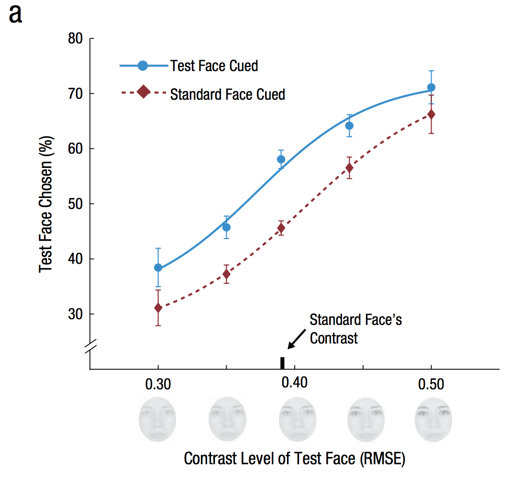
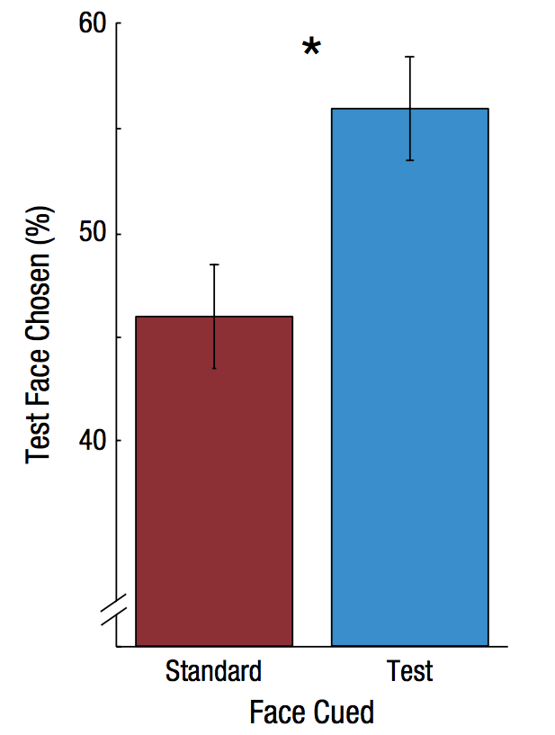

<!-- Replication reports should all use this template to standardize reporting across projects.  These reports will be public supplementary materials that accompany the summary report(s) of the aggregate results. -->

##Introduction
In their study, Störmer & Alvarez (2016) tested whether attention can alter the appearance of real-world stimuli. They asked three questions: **1)** Does attention alter perceived attractiveness of faces? **2)** Is the change in attractiveness judgments driven by exogenous (involuntary) attention? **3)** Does the attentional cue influence attractive judgments by modulating the apparent local contrast of the faces? Their results showed that attention altered the perception of facial attractiveness which belongs to higher-level aspects of perception. **In the current replication project, we aim to replicate Experiment 3 of the original study in which the authors found that attention increased the apparent contrast around the eye region of faces which has been reported to modulate facial attractiveness.**

***

##Methods

###Power Analysis
The effect size for the key statistical test (the paired-samples *t* test) reported in the original paper was $\eta^2=0.30$. We computed *Cohen's d~z~* based on statistics provided in the paper (55.8% vs. 45.8%, $t$(15) = 2.51, $p$ = .02, $\eta^2$=0.30).
```{r}
N <- 16
meanDiff <- 55.8 - 45.8
t <- 2.51  # t = meanDiff / se_of_meanDiff
se_d <- meanDiff/t
s_d <- se_d * sqrt(N) # standard deviation of the mean differences
d_z <- meanDiff / s_d
# also equals
d_z <- t/sqrt(N)
```
Based on the computed effect size of *d~z~* = `r d_z`, we performed post hoc power analysis using G*Power. The analysis indicated that the power of the original study was _0.65_. We would need a sample size of _N_ = 22 to achieve 80% power, _N_ = 29 to achieve 90% power, and _N_ = 35 to achieve 95% power to be able to detect the reported effect size. We aim to acieve 80% power. However, to shorten the duration of the experiment for each participant, we are going to split the experiment into halves and double the number of participants. That will give us _N_ = 44.

###Planned Sample
We plan to recruit 44 US participants on the Amazon Mechanical Turk. 
<!--Planned sample size and/or termination rule, sampling frame, known demographics if any, preselection rules if any.-->

###Materials
<!-- All materials - can quote directly from original article - just put the text in quotations and note that this was followed precisely.  Or, quote directly and just point out exceptions to what was described in the original article. -->
 
    "A small black fixation cross (0.5° × 0.5°) was presented in the center of the screen throughout the experiment. Two small horizontal lines (~0.5° long) were presented to the left and right of fixation and served as landmarks for the horizontal midline of the screen. The target display consisted of two faces (each 8° × 6°) that were presented to the left and right of fixation at an eccentricity of 6°. The face images were chosen from 20 images of female Caucasian faces (approximate age range from 20 to 30 years) taken from Bronstad and Russell’s (2007) database. They were converted to gray scale and cropped such that only their inner features (no hair or neck) were visible. All the faces were matched in overall brightness (104 cd/m2), but the contrast of the eye region was systematically manipulated for each face. Specifically, a mask (handdefined in Adobe Photoshop) covering the eyes and the eyebrows was created for each face, and the contrast within that mask was manipulated by parametrically changing the standard deviation of that section of the image using MATLAB (The MathWorks, Natick, MA). This decreased or increased the luminance differences around the eye region in the face. For each face, five different contrast levels were created. These levels were measured in terms of root-mean-square error (RMSE) of the pixels’ luminance values within the masked region. Contrast levels of 0.30, 0.35, 0.39, 0.44, and 0.50 RMSE were used." (from Störmer & Alvarez p.565.)  

The experimental materials used in the original study (i.e., contrast manipulated face images) were provided by the original authors. Although we used the same stimuli, the size, brightness and spacing of stimuli could not be precisely controlled due to several constraints in the experimental settings as our experiment was conducted online on the Amazon Mechanical Turk (e.g., different displays, web browing environments, etc). However, we tried to keep the relative sizes and positions of stimuli as close to those in the original study as possible. 

###Procedure
<!-- Can quote directly from original article - just put the text in quotations and note that this was followed precisely.  Or, quote directly and just point out exceptions to what was described in the original article. -->

    "The experiment was conducted in a dimly lit room, and the stimuli were presented on a 15-in. CRT display (1,280 × 1,024 pixels; 85 Hz) whose background color was set to gray (111 cd/m2). Participants viewed the stimuli at a distance of 57 cm, and a chin rest was used to stabilize their heads. Participants’ gaze was tracked with an eye tracker (EyeLink 1000, SR Research Ltd., Mississauga, Ontario, Canada) to ensure fixation. The experiment was run in MATLAB using the Psychophysics Toolbox (Brainard, 1997; Pelli, 1997).
    Participants were instructed to maintain their gaze on the fixation cross in the center of the gray screen throughout each experimental block. When they moved their gaze more than 1.5° away from fixation, the trial was aborted. At the beginning of each trial, a black circle appeared briefly (~70 ms) on either the left or the right side of the screen. After another 58 ms, face images were presented simultaneously on the left and right for 58 ms (Fig. 1a). Thus, the stimulus onset asynchrony (SOA) between the attentional cue and the faces was 128 ms. After the offset of the faces, the gray screen with the fixation cross was presented until the participant responded. The intertrial interval varied from 1.0 to 1.5 s. On two thirds of the trials, two different faces were randomly selected from the set of 20 faces to be presented as the target display. One of the faces was presented at the standard contrast (Level 3), and the other face was presented at one of the test contrasts (Levels 1–5). On the other third of the trials, the exact same face was presented on the left and right at the standard contrast. These trials were included so that we could compare responses to cued and uncued faces while all physical attributes of the two faces were matched. The analyses of the effects of the attentional cue on attractiveness judgments focused on these matched-face trials." (from Störmer & Alvarez p.565.)  

    "Experiment 3 followed the same procedure as Experiment 1 except for the task instructions. Participants were asked to report the vertical positioning (upward or downward) of the face that appeared to have higher contrast around the eye region by pressing the up- or down-arrow key on a keyboard. Prior to the experiment, participants were shown three example stimuli and were told that contrast varied around the eye region. As in the other experiments, participants were told that the black dot (the attentional cue) was task irrelevant." (from Störmer & Alvarez p.565.) 

The experimental procedures were followed precisely, excxept for the following changes:

* The presentation of stimuli was controlled by javascript.
* As mentioned before, we did not have control over the size, resolution and refresh rate of displays. Also, the testing environments were considerably different from the original study -- Turkers' presumably worked from their home viewing the screen at a random distance without a chin rest and without an eye tracker recording their gaze positions.
* There were also a few differences in the duration of stimulus presentation. Considering that the most common refresh rates for computer screens include 30Hz and 60Hz, we fixed the lengths of cue and face presentation at 66 ms instead of 70 ms and 58 ms, respectively. Thus, the stimulus onset asynchrony (SOA) between the attentional cue and the faces in our version of the experiment was 132 ms which was 4 ms longer than in the original study. However, we did not expect that difference to be effective enough to abolish the attentional cueing effect.
* To reduce the length of the experiment 10 instead of 20 faces were used for each participant. We splitted the faces into two sets and randomly assigned which set would be used for each participant. The remaining 10 faces appeared in practice trials.
* Participants practiced the task at lower speed in some portion of practice trials.

###Analysis Plan
>There was a main effect of actual contrast level on contrast judgments, $F$(4, 15) = 27.93, $p$= .0001, $\eta^2$ = .31. Participants chose the face with higher contrast around the eye region more often than the face with lower contrast around the eye region. As in the previous experiments, our main analysis focused on the matched-face trials, in which identical faces were presented at Contrast Level 3. As shown in Figure 4b, __when the two faces were physically identical, participants tended to judge the face at the cued location to have higher contrast than the face at the uncued location (55.8% vs.45.8%), $t$(15) = 2.51, $p$ = .02, $\eta^2$ = .30.__ (from Störmer & Alvarez p.568.)

<!--Can also quote directly, though it is less often spelled out effectively for an analysis strategy section.  The key is to report an analysis strategy that is as close to the original - data cleaning rules, data exclusion rules, covariates, etc. - as possible. --> 

<!--**Clarify key analysis of interest here**  You can also pre-specify additional analyses you plan to do.-->

#### Key Analysis of Interest
The __dependent variable__ (DV) of interest in Experiment 3 of the original study was __the _percentage_ of trials where participants judged the *"test" face* as having higher contrast than the *"standard" face*__ (contrast fixed at Level 3). Specifically, they focused their analysis on the _"matched-face"_ trials in which the actual contrast of _test_ and _standard_ faces was _identical_ (i.e., both Level 3 and of the same identity). That is, they compared participants' responses from the matched-face trials in Test Face Cued and Standard Face Cued conditions to scrutinize __the effect of attentional cue__ (IV) on the contrast judgment, controlling for physical difference. 

The original authors conducted a _paired-samples t_ test to examine the effect of attention _within_ participants and found that attention had a significant effect on participants' responses (55.8% vs.
45.8%), $t$(15) = 2.51, $p$ = .02, $\eta^2$ = .30 (*d~z~* = `r d_z`).

#####__The key analysis of interest__ in this replication is, therefore, a _paired-sample t_ test to determine whether or not the percentage of cued faces being chosen is equal to the percentage of uncued faces being chosen.  
  
    
As subsidary analyses, we are going to replicate:

* The two-way repeated measures ANOVA to test the main effects of the contrast level and the cue condition.

* Figure 2a showing participants' choices as a function of contrast of the test face, for test face cued and for standard face cued conditions separately.  
  
  
Finally, we will perform the following additional analyses:

* Mixed-effects logistic regression to model binary responses (test vs. standard)

* Logistic (logit) regression to model individual participants' responses

###Differences from Original Study
The original study was conducted in a highly controlled experimental setting typical for psychophysics experiments, whereas our study will be conducted online. We will have less control over the display (e.g., size, luminance, resolution, refresh rate etc.), timing of stimulus presentation, testing environment and so on.

- Contrast & luminance: Although we will not be able to control the absolute contrast/luminance shown to participants, we expect that relative differences between images will be maintained. In addition, we might be able to infer whether different contrasts were distinguishable on participants' screen by looking at the effect of contrast on each participant's reponses.
- Screen dimension & stimulus size: There is a possibility that the size of stimuli or the distance to targets from the fixation point might affect experimental results. It has been well documented that visual task performance is modulated by eccentricity, and it also has been reported that the effect of exogenous attention depends on the size of the cue. However, while it is possible that such factors can make participants' performance vary, we expect that the variance could be explained by a subject factor.
- We did not include difference face trials which composed 2/3 of the trials. Because only the same face trials were included in the analysis in the original study, we reasoned that this decision would not cause a significant difference in results.
- We do not have eye tracking data collected from mturk participants, whereas the original authors aborted trials where participants' gaze deviated more than 1.5° away from the fixation. This difference could have made our data less reliable. We emphasized the importance of fixating in the center repeatedly during the experiment to minimize any possible biases resulted from this limitation so far as possible.
<!--Explicitly describe known differences in sample, setting, procedure, and analysis plan from original study.  The goal, of course, is to minimize those differences, but differences will inevitably occur.  Also, note whether such differences are anticipated to make a difference based on claims in the original article or subsequent published research on the conditions for obtaining the effect.-->

<!--### Methods Addendum (Post Data Collection)

You can comment this section out prior to final report with data collection.-->

#### Actual Sample
<!-- Sample size, demographics, data exclusions based on rules spelled out in analysis plan -->

#### Differences from pre-data collection methods plan
<!--  Any differences from what was described as the original plan, or “none”. -->


***

##Results


### Data preparation

<!--Data preparation following the analysis plan.-->
	
```{r echo=F, include=F}
rm(list=ls())
####Load Relevant Libraries and Functions
library(tidyverse)
library(jsonlite)
library(purrr)
# library(quickpsy)
# library(boot)
library(lsr)
library(ez)
library(grid)
library(gridExtra)
library(scales)
library(lme4)
library(sjPlot)
theme_set(ggthemes::theme_few())
options(digits=2)

```

```{r error=FALSE, warning=FALSE}
###Data Preparation
path <- "~/class/StanfordPsych254/stormer/"
files <- dir(paste0(path,"anonymized-results/"), 
             pattern = "*.json")
d.raw <- data.frame()
d_practice <- data.frame()
####Import data
for (f in files) {
  jf <- paste0(path, "anonymized-results/",f)
  jd <- fromJSON(paste(readLines(jf)))
  expt <-jd$answers$data$experiment
  stimcond <- data.frame(face=na.omit(expt$face),
                     cue=na.omit(expt$cue),
                     cueLoc=na.omit(expt$cueLoc),
                     leftUp=na.omit(expt$leftUp),
                     testPos=na.omit(expt$testPos),
                     testContrast=na.omit(expt$testContrast),
                     rt=na.omit(expt$rt),
                     keypress=na.omit(expt$keypress),
                     ITI=na.omit(expt$ITI))
  id <- data.frame(workerid = jd$WorkerId)
  whichFaceSet <- data.frame(whichSet = 
                              as.integer(jd$answers$data$data$answer[4]))
  id <- cbind(id,stimcond,whichFaceSet)

  d.raw <- bind_rows(d.raw, id)
  
  # load practice data
  prac <- jd$answers$data$practice
  pracAns <- data.frame(testContrast = na.omit(prac$testContrast),
                        testPos=na.omit(prac$testPos),
                        leftUp=na.omit(prac$leftUp),
                        keypress=na.omit(prac$keypress))
  id <- data.frame(workerid = jd$WorkerId)
  id_p <- cbind(id,pracAns)
  d_practice <- bind_rows(d_practice,id_p)
}

# Number of participants
allWorkers = length(unique(d.raw$workerid))

```

#### Data exclusion / filtering
```{r}
# exclude those who got less than 50% correct for contrast level 1 and 5 in the practice run
d_practice<-d_practice %>%
  mutate(testVertical = factor(ifelse((testPos=="left"&leftUp==T)|(testPos=="right"&leftUp==F),"up", ifelse((testPos=="left"&leftUp==F)|(testPos=="right"&leftUp==T),"down",NA)))) %>%
  mutate(correctAns = ifelse(testContrast > 3,"test", ifelse(testContrast < 3,"standard","none"))) %>%
  mutate(chosen = factor(ifelse(testVertical==keypress,"test","standard"))) %>%
  mutate(correct = ifelse(chosen==correctAns,1, ifelse(chosen!=correctAns & correctAns!="none", 0,NA)))
# contrast 1 and 5 trials
d_prac <- d_practice[d_practice$testContrast==1 | d_practice$testContrast==5, ]
# % correct
pracResult <- d_prac %>%
  group_by(workerid) %>%
  summarise(correctPer=sum(correct)/n())
# search subject with % under 50
exclude <- which(pracResult$correctPer<.5)

d_backup <- d.raw
for (i in exclude) {
  exWorker = paste0("anon",i)
  d <- d[-c(which(d.raw$workerid==exWorker)),]
}
numWorkers <- allWorkers - length(exclude)
```

`r length(exclude)` participants were excluded from analysis based on their performance in the practice run.


#### Prepare data for analysis - create columns etc.
```{r}
# as factor
d.raw[sapply(d.raw, is.character)] <- lapply(d.raw[sapply(d.raw, is.character)], as.factor)
d.raw$face <- factor(d.raw$face)
d.raw$testContrast <- factor(d.raw$testContrast)
d.raw$whichSet <- factor(d.raw$whichSet)

# retrieve the face chosen and the vertical position of target face in each trial
d<-d.raw %>%
  mutate(testVertical = factor(ifelse((testPos=="left"&leftUp==T)|(testPos=="right"&leftUp==F),"up", ifelse((testPos=="left"&leftUp==F)|(testPos=="right"&leftUp==T),"down",NA)))) %>%
  mutate(chosen = factor(ifelse(testVertical==keypress,"test","standard"))) %>%
  mutate(correctAns = ifelse(as.numeric(testContrast) > 3,"test", 
                             ifelse(as.numeric(testContrast) < 3,"standard","none"))) %>%
  mutate(correct = ifelse(chosen==correctAns,1, 
                                 ifelse((chosen!=correctAns & correctAns!="none"), 0,NA)))

d_15 <- d[d$testContrast==1 | d$testContrast==5, ]
exptCorrect <- d_15 %>%
  group_by(workerid) %>%
  summarise(correctPer=sum(correct)/n())

# calculate the % of trials where participants answered that "test" face had higher contrast than "standard" face
tbl <- d %>% 
  group_by(workerid,cue,testContrast) %>%
  summarise(n=n(),testChosen=sum(chosen=="test"), 
            standardChosen=sum(chosen=="standard"),
            pctTest=testChosen/n*100,
            whichFace=unique(whichSet))

# prep data for plotting
tbl <- tbl %>%
  group_by(workerid) %>%
  mutate(workerMean=mean(pctTest)) %>% # worker means across conditions
  ungroup() %>%
  mutate(grandMean=mean(workerMean)) %>% # grand mean across subjects
  # To compute within subject errors later
 # new value = old value – subject average + grand average
  mutate(newPct=pctTest-workerMean+grandMean)
```

### Confirmatory analysis
#### ANOVA: manipulation check
```{r warning=FALSE}
aov_rep <- ezANOVA(data=tbl, dv=pctTest, wid=workerid,within=.(testContrast,cue),detailed=TRUE)
print(aov_rep)
```

``` {r echo=FALSE}
coeff <- aov_rep$ANOVA
coeff$p <- format(coeff$p, scientific=FALSE)
coeff$DFd <- as.integer(coeff$DFd)
coeff$DFn <- as.integer(coeff$DFn)
```

Our repeated-measures analysis of variance (ANOVA) revealed a main effect of physical contrast on contrast judgments, $F$(`r coeff$DFn[2]`, `r coeff$DFd[2]`) = `r coeff$F[2]`, $p$ = `r sprintf("%.2f", as.numeric(coeff$p[2]))`, $\eta^2$ = `r coeff$ges[2]`. 

There was no main effect of cue condition, $F$(`r coeff$DFn[3]`, `r coeff$DFd[3]`) = `r coeff$F[3]`, $p$ = `r sprintf("%.2f", as.numeric(coeff$p[3]))`, $\eta^2$ = `r sprintf("%.2f", as.numeric(coeff$ges[3]))`. <!--However, there was interaction between cue condition and contrast level, $F$(`r coeff$DFn[4]`, `r coeff$DFd[4]`) = `r coeff$F[4]`, $p$ = `r coeff$p[4]`, $\eta^2$ = `r coeff$ges[4]`. -->
Interaction: $F$(`r coeff$DFn[4]`, `r coeff$DFd[4]`) = `r coeff$F[4]`, $p$ = `r sprintf("%.2f", as.numeric(coeff$p[4]))`, $\eta^2$ = `r sprintf("%.2f", as.numeric(coeff$ges[4]))`

The original authors only reported the main effect of contrast level in Experiment 3, $F$(4, 15) = 27.93, $p$ = .0001, $\eta^2$ = .31.  

<br>

<!-- *Side-by-side graph with original graph is ideal here* -->
#### Replication of Figure 4a. Psychometric functions
<!-- <div style="width: 400px;"> -->
<!--  -->
<!-- </div> -->
<!-- <!--  --> 

<!-- "The psychometric functions (a) show the percentage of all trials in which participants chose the test face as having higher contrast than the standard face as a function of the test face’s contrast. Error bars represent ±1 SEM (within subjects). *p<.05."   -->

<!-- <br> -->
  
#### Psychometric curve fit (weibull) using MLE
```{r}
# get mean psychometric data points across subjects
psychometric <- tbl %>% 
  group_by(cue,testContrast) %>%
  # mean and within subject errors
  summarise(avePct=mean(pctTest), se=sd(newPct)/sqrt(n()),
            ntrial=mean(n),aveTestChosen=mean(testChosen),
            sumTest=sum(testChosen),sumN=sum(n))
psychometric <- psychometric %>%
  mutate(RMScontrast = c(.30,.35,.39,.44,.50))

```


```{r fig.width=6, fig.height=4.8, fig.align="center"}
RMScontrast = c(.30,.35,.39,.44,.50)
x<-RMScontrast
n<-psychometric$sumN #n trial per condition
k <- psychometric$sumTest # number of times that the observer reports that can see the stimulus
y <- k/n
cue <- psychometric$cue
dat <- data.frame(cue,x, k,n, y)
# define function that ouputs best function parameters
fitting <- function(df){
  nll <- function(p) { 
  phi <- pweibull(df$x, p[1], p[2]) 
  -sum(df$k * log(phi) + (df$n - df$k) * log(1 - phi))
  }
para <- optim(c(.7,.7), nll)$par
xseq <- seq(.3,.5,.001)
yseq <- pweibull(xseq, para[1], para[2])
data.frame(xseq,yseq) 
}
# plotting the curves
npoints <- 201
# prediction with fit values
curves <- dat %>%
  split(.$cue) %>%
  map_df(fitting)
curves$cue <-rbind(matrix(rep("standard",npoints)), matrix(rep("test",npoints)))

# plot
p<- psychometric %>%
  ggplot(aes(x=RMScontrast,y=avePct,group=cue,color=cue)) +
  geom_pointrange(aes(ymin=avePct-se, ymax=avePct+se)) +
  geom_line(data=curves,aes(x=xseq,y=yseq*100,color=cue)) +
  geom_segment(aes(x=.39,xend=.39, y=-Inf, yend=5),color="black",size=1.4) +
  xlim(0.28,0.52)+
  ggthemes::theme_few()+ 
  xlab("Contrast Level of Test Face (RMSE)") +
  ylab("Test Face Chosen (%)") +
  theme(legend.position = c(0,1), legend.justification = c(0,1),
        legend.background= element_rect(fill=NA, color=NA),
        legend.title = element_blank()) +
        scale_color_brewer(type="qual",palette=6, labels=c("Standard Face Cued","Test Face Cued"), guide=guide_legend(reverse=TRUE))
# p
```
<br>

##### Side-by-side comparison with the original graph
```{r echo=FALSE, fig.width=8}
fig_a <- rasterGrob(png::readPNG("../writeup/figures/figure4a.png"), interpolate=TRUE)
rep_a <- ggplotGrob(p+theme(legend.text=element_text(size=rel(0.6))))

grid.arrange(arrangeGrob(fig_a,rep_a, ncol=2), heights=unit(0.70, "npc"))
```


####Key statistics: *Paired-samples t*

<!-- <div style="width: 250px;"> -->
<!--    -->
<!-- </div> -->
<!--  -->

<!-- "The bar graph (b) shows the percentage of matched-face trials (Contrast Level 3) in which the test face was judged to have higher contrast than the standard face in each of the cue conditions. Error bars represent ±1 SEM (within subjects). *p<.05." -->

```{r fig.width=3.8, fig.height=3.8, fig.align="center"}
# matched-face trials
d_sum <- tbl %>%
  group_by(workerid) %>%
  mutate(workerMean_3 = mean(pctTest)) %>%
  ungroup() %>%
  mutate(grandMean_3 = mean(workerMean)) %>%
  mutate(newPct3 = pctTest - workerMean_3 + grandMean_3)
d_t <- d_sum[d_sum$testContrast=="3",]

bar <- d_t %>%
  group_by(cue) %>%
   # mean and within subject errors
  summarise(avePct=mean(pctTest), se=sd(newPct3)/sqrt(n()),
            ntrial=mean(n), aveTestChosen=mean(testChosen),
            sumTest=sum(testChosen), sumN=sum(n))

bargraph<-bar %>%
  ggplot(aes(x=cue,y=avePct,fill=cue)) +
  geom_bar(stat = "identity", position = "dodge",width = 0.6) +
  geom_linerange(aes(ymin=avePct-se, ymax=avePct+se)) +
  ggthemes::theme_few() + 
  xlab("Face Cued") +
  ylab("Test Face Chosen (%)") +
  theme(legend.position="none") + 
  scale_y_continuous(limits = c(30, NA),oob = rescale_none) +
  scale_fill_brewer(type="qual",palette=6)
# bargraph
```

##### Conduct a paired t test (test vs. standard face, Contrast Level 3)
```{r warning=FALSE}
#conduct a paired t-test (test VS standard face, Contrast=3)
ttest<-t.test(pctTest ~ cue, d_t, paired=TRUE)
ttest
# cohen's effect size measure
dz<-cohensD(pctTest ~ cue, data=d_t, method="paired")
print(dz)

```

<!--We confirmed the original finding that the attended (cued) face was judged to have higher contrast than the same face that was unattended--> `r bar$avePct[2]`% vs. `r bar$avePct[1]`%, $t$(`r ttest$parameter`) = `r ttest$statistic`, $p$ = `r ttest$p.value`, $\eta^2$ = `r coeff$ges[3]`. 

The original paper reported 55.8% vs. 45.8%, $t$(15) = 2.51, $p$ = .02, $\eta^2$ = .30.

<br><br>

##### Side-by-side comparison with the original graph
```{r echo=FALSE, fig.height=3.8}
fig_b <- rasterGrob(png::readPNG("../writeup/figures/figure4b.png"), interpolate=TRUE)
rep_b <- ggplotGrob(bargraph)

grid.arrange(arrangeGrob(fig_b,rep_b, ncol=2),heights=unit(0.84, "npc"))
```


|  Original  |  Replication  |
|:----------:|:-------------:|
| $t$(15) = 2.51, $p$ = .02, $\eta^2$ = .30 | $t$(`r ttest$parameter`) = `r ttest$statistic`, $p$ = `r ttest$p.value`, $\eta^2$ = `r coeff$ges[3]` |
|     |     |
  
  
<p><br></p>
  

###Exploratory analyses

####Logistic regression
Fitting the logit to our binary response data using the GLM
```{r }
# data preparation
# adding a 0/1 binary response column in the raw dset
d$choice <- as.numeric(d$chosen) - 1
d$rms <-d$testContrast
levels(d$rms) <- RMScontrast
d$rms <- as.numeric(as.character(d$rms))
tbl$rms <-RMScontrast

# defining a function to perform logistic regression for individual data
logFit <- function(df,tb) {
logreg <- glm(formula = choice ~ cue + rms - 1, family = "binomial", df)
#get predicted responses from the model prediction
xseq <- seq(.3,.5,.001)
y_t <- predict(logreg,data.frame(cue="test",rms=xseq),type = "response")
y_s <- predict(logreg,data.frame(cue="standard",rms=xseq),type = "response")
#organize as data frame
curve_log <- data.frame(rbind(matrix(y_s),matrix(y_t)))
colnames(curve_log) = "yseq"
curve_log$cue <-rbind(matrix(rep("standard",npoints)), matrix(rep("test",npoints)))
curve_log$xseq = xseq

logplot <- df %>%ggplot(aes(x=rms,y=choice)) +
  geom_point(aes(x=rms, y=choice, color=cue),shape=21, fill=NA,alpha=0.7,
             position=position_jitter(width =.006,height = .04)) +
  geom_line(data=curve_log,aes(x=xseq,y=yseq,color=cue)) +
  ggthemes::theme_few() +
  theme(legend.position="none") +
  geom_point(data=tb,aes(x=rms, y=pctTest/100, color=cue)) +
  ylab("p test") +
  xlab("RMSE") +
  scale_color_brewer(type="qual",palette=6)
return(logplot)
}
```

```{r fig.height=8,fig.width=8}
# for loop to generate figures for each participant
workerID=unique(d$workerid)
plots <- list()
for (i in 1:numWorkers) {
  plots[[i]] <- logFit(d[d$workerid==workerID[i],], tbl[tbl$workerid==workerID[i],])
}
# plotting all
do.call(grid.arrange,c(plots,ncol=3))
```
  
  <br>
  
##### Individual differences as a function of test contrast
```{r}
# examine individual differences
d_sum %>% #only matched trials here
  ggplot(aes(x=cue,y=pctTest,group=workerid, color=workerid)) +
  geom_line() +
  geom_point(size=1.6, shape=21) +
  facet_grid(.~testContrast) +
  ggtitle("Test Contrast") +
  xlab("Face Cued") +
  ylab("Test Face Chosen (%)") +
  theme(plot.title = element_text(hjust = 0.5,size=rel(1)),
        legend.position = "bottom") + 
  scale_color_brewer(type="qual",palette=7)
```
  
  <br>
  
#### Mixed effects logistic regression
```{r warning=FALSE}
# focusing on contrast level 3 only
# model comparisons?
d3 <- d[d$testContrast==3,]
# random intercept
log1 <- glmer(choice ~ cue + (1|workerid), family = "binomial", d3)
#random slope
log2 <- glmer(choice ~ cue + (1+cue|workerid), family = "binomial", d3)
anova(log1,log2)
```

```{r warning=FALSE}
# including all contrast levels.....
# model comparisons?
# random intercept
mixedLog1 <- glmer(choice ~ cue + rms + (1|workerid), family = "binomial", d)
mixedLog2 <- glmer(choice ~ cue * rms + (1|workerid), family = "binomial", d)
anova(mixedLog1,mixedLog2)
# random slope
mixedLog3 <- glmer(choice ~ cue + rms + (1+cue|workerid), family = "binomial", d)
anova(mixedLog1,mixedLog3)
mixedLog4 <- glmer(choice ~ cue + rms + (1+cue+rms|workerid), family = "binomial", d)
anova(mixedLog4,mixedLog3)
# item effect
# mixedLog5 <- glmer(choice ~ cue + rms + (1+cue+rms|workerid) + (1|whichSet), family = "binomial", d)
## model doesn't converge...
# anova(mixedLog5,mixedLog4)

summary(mixedLog4)

sjp.setTheme(axis.textsize.x = 0.7)
sjp.glmer(mixedLog4, y.offset = .4)
```


***
  
## Discussion

### Summary of Replication Attempt

<!--Open the discussion section with a paragraph summarizing the primary result from the confirmatory analysis and the assessment of whether it replicated, partially replicated, or failed to replicate the original result.  -->

### Commentary

<!--Add open-ended commentary (if any) reflecting (a) insights from follow-up exploratory analysis, (b) assessment of the meaning of the replication (or not) - e.g., for a failure to replicate, are the differences between original and present study ones that definitely, plausibly, or are unlikely to have been moderators of the result, and (c) discussion of any objections or challenges raised by the current and original authors about the replication attempt.  None of these need to be long.-->
